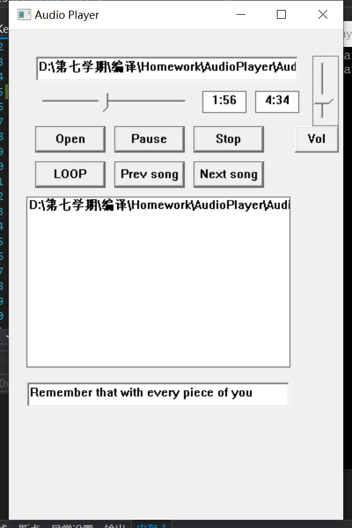

# 说明文档——音乐播放器

金昕祺 2016010524

汪元标 2016010327

张欣炜 2016010151

---

## 开发环境

Win10 + Visual Studio 2019 + masm + Irvine

## 提交文件说明

main.asm中实现了GUI窗口，以及各种交互事件的逻辑处理。PlayerKernel.asm中实现了音频与歌词相关的各种操作。cmd.asm是一个命令行版的demo。main.asm与cmd.asm不能同时参与生成。

在ext文件夹中，我们提供了一些可以用来测试的音频文件与歌词文件。当然用其他的文件测试也是可以的。

## 实现原理

- 音频文件相关操作

  使用了winmm.lib中的`mciSendString`函数，通过该函数发送不同的命令，实现播放、暂停、跳转、调整音量等音乐播放器的基础操作。支持wav, mp3, m4a等多种音频格式。
  
- GUI事件响应

  窗口的事件处理主要由`WndProc`完成。窗口中的各种事件都会交给该函数处理。程序中主要会涉及到如下的事件类型：

  - `WM_DESTROY`与`WM_CREATE`分别代表窗口销毁与创建。创建时需要初始化窗口的各个组件。
  - `WM_TIMER`是定时器相关的事件，用于更新进度条位置。
  - `WM_HSCROLL`会在进度条被拖动的时候产生，用于设置音乐的跳转。
  - `WM_VSCROLL`会在音量控制条被拖动时产生，用于控制播放器的音量。
  - `WM_COMMAND`会在按钮被点击时产生。

- 进度条

  进度条是通过Trackbar控件实现的，通过定时器发送的`WM_TIMER`事件更新位置，通过`WM_HSCROLL`事件实现跳转功能。

- 歌词

  歌词主要涉及到解析与显示。歌词文件通常是lrc格式，这种格式比较简单，解析lrc文件主要与字符串的各种操作相关。解析完成后即可得到每一句歌词，以及其对应的时间点。
  
  接下来同样借助`WM_TIMER`事件，每隔一定时间间隔，获取当前播放进度，然后寻找对应时间点的歌词，将其显示出来。

## GUI介绍

如上图，我们的程序支持实时显示歌词。如果需要显示歌词，需要在打开的音乐文件的同名目录下有一个和程序相同名称的后缀为.lrc的文件

## 难点与创新点

- 对音频文件的操作

  最开始我打算自己实现对声卡以及各种音频文件的解析与操作。但是通过查阅资料，了解各种音频格式与压缩算法之后，我认为自己实现起来工作量会难以控制，有可能无法按时完成。因此我决定查找windows是否提供了相应的API来完成对应的操作。

  这一部分代码写出来不算复杂，但是搜集资料的过程非常困难。主要原因在于masm的社区不够活跃，难以找到有效的信息。最开始找到了`PlaySound`这个API，但是这个API提供的操作非常有限，只能做到播放与停止，同时仅支持wav格式音频。这显然不能满足我们音乐播放器的需求。

  经过了大量的查阅资料后，我找到了`mciSendString`这一API。经过测试，这一API可以完成我们需要的全部操作，同时支持多种常见音频格式。因此我们选择利用这一API完成对音频的各种操作。

- 播放进度条

  - 采用Trackbar控件支持进度条的拖放操作，每次拖动进度条或者点击进度条或者点击方向键时，就会产生一个`HSROLL`系统消息，在程序主消息循环中，对这个消息通过获取`lParam`得到当前进度的百分比，将其转换为实际毫秒进度后重置歌曲播放的位置。
  - 同时，歌曲播放的时候需要实时切换进度条的位置，为此，设置了一个系统计时器，每次计时器Time out 时，就会发送一个`WM_TIMEOUT`消息，主消息循环会处理这个消息，然后根据当前歌曲播放的毫秒进度算出百分比进度，从而发送消息来调整进度条的位置。
  - 一个容易出现的问题是：如果计时器的频率太快，那么在拖动进度条时，很可能发送`HSCROLL`消息时，与`WM_TIMEOUT`消息冲突，从而导致进度条并未被拖动，反而会出现”跳回去“的情况，为了解决这个问题，将计时器的时间设为1s，从而使得这种情况发生的概率几乎为0。
  - 音量条的逻辑类似，只不过不用自动变化。

- 播放列表、切歌与循环

  程序可以记录播放过的5首歌曲（**如果需要修改播放列表的长度，只需要修改main.asm中的"maxFileNum          equ 5"，将5改成其他正整数，然后重新生成可执行程序即可，无需其他操作**）。这是通过维护一个队列实现的。每当打开一个音频文件，程序会将其加入队首。如果队列已满，则会覆盖掉最早的那首。

  借助播放列表，就可以实现切歌与列表循环。可以直接双击播放列表中的某一项，切换到对应的歌曲。也可以点击上一首/下一首按钮，切换到播放列表中的上一首或下一首。

- 歌词的解析
 
  我们的程序支持解析歌词，歌词的解析是通过PlayerKernel.asm中定义的parseLRC方法实现的。歌词解析的工作流程大致为：
  1. 每一轮解析开始时，找到歌词文件尚未解析的部分的第一对中括号（即'['和']'），判断括号内的内容是否为合法的时间格式（即'm:s.ms'格式，其中m表示分钟数，s表示秒数，ms表示毫秒数）。
  2. 若解析到的一对中括号内的值为合法时间格式则将时间转换为以毫秒为单位的值并存在一个DWORD数组里，然后从该轮循环中找到的']'后面解析出歌词的内容（通过一些指定的终止符来截断歌词内容）并存储到BYTE数组里，然后调整未解析的部分为解析到的歌词后面的内容；若中括号内不是合法时间格式，则调整未解析的部分为解析到的一对中括号后面的内容。
  3. 若解析到文件内容的结尾，则退出解析；否则返回到步骤一，进行下一轮解析。

  需要注意的是，我们的代码仅支持单句歌词长度不超过128个字节，支持的格式为简单LRC格式（定义见[维基百科](https://zh.wikipedia.org/wiki/LRC%E6%A0%BC%E5%BC%8F)），要求LRC文件和音频文件同名（不包括后缀）、同目录、后缀为lrc。

## 分工 

- 张欣炜对音乐播放器的实现方案进行了前期的调研与踩坑。完成了对音频文件的各种操作的封装，实现了一个简单的命令行版的demo。
- 汪元标完成了GUI的设计，搭建了基本的GUI事件消息处理框架，完成了GUI的打开文件、播放、暂停、进度条、可隐藏音量条功能。
- 金昕祺完成了播放列表与切歌功能，为GUI添加细节，实现了歌词的解析，并完善了程序对异常的处理。
